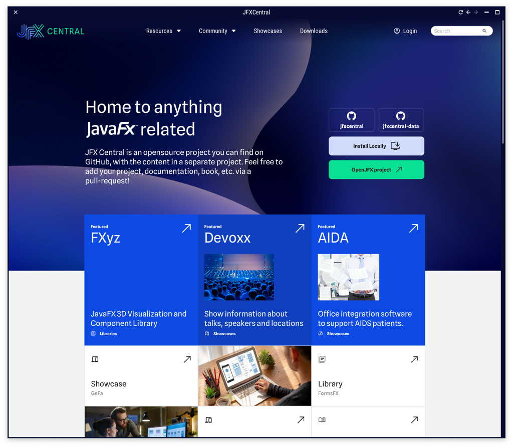

[](https://sourcespy.com/github/dlemmermannjfxcentral2/)

# JFXCentral 2

This repository contains the codebase used for the desktop AND the web AND the mobile version.

## Running the application

- Desktop app via IDE: to launch the app as a desktop app simply run the `JFXCentral2App` class.
- Desktop app via Maven: run `javafx:run` inside the "app" module.
- Web app via Maven: run `jpro:run` inside the "app" module. Make sure to run `install` first.
- Mobile app via Maven: run `install`, `gluonfx:build`, `gluonfx:package` `gluonfx:install`

## Technical vs. Content Issues

If you do encounter any technical issues, then please [create a ticket in this repository](https://github.com/dlsc-software-consulting-gmbh/jfxcentral2/issues). If the issue is 
related to content then please create the ticket in the issue tracker of the [jfxcentral-data](https://github.com/dlsc-software-consulting-gmbh/jfxcentral-data/issues) repository.



## Building

### Native App on Linux (Android)

Download Gluon GraalVM from https://github.com/gluonhq/graal/releases and unzip. Then follow these steps:

```
sudo apt-get update
sudo apt install libasound2-dev libavcodec-dev libavformat-dev libavutil-dev libgl-dev libgtk-3-dev libpango1.0-dev libxtst-dev
export JAVA_HOME=~/Downloads/graalvm-java23-linux-amd64-gluon-23+25.1-dev/
export GRAALVM_HOME=~/Downloads/graalvm-java23-linux-amd64-gluon-23+25.1-dev/

# Build for Linux
./mvnw -DconsoleProcessLog=true -pl app gluonfx:build gluonfx:package

# Build for Android
./mvnw -DconsoleProcessLog=true -pl app -Pandroid gluonfx:build gluonfx:package
```


